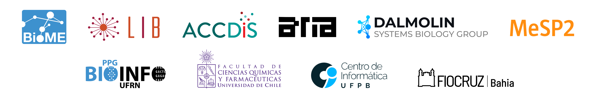

# integrativebioinformatics/longnoncoder 

`LongNonCoder` is a Nextflow pipeline designed for isoform-level lncRNA discovery and characterization from long-read RNA-seq data. The workflow encompasses QC, mapping, transcriptome assembly and quantification, followed by a detailed final characterization of the entire transcriptome with particular emphasis on lncRNA structure and isoforms across known annotations and novel candidates.

For more details and further functionality, please refer to the [usage](docs/usage.md) and [output](docs/output.md) documentations.

> [!IMPORTANT]
> LongNonCoder is compatible Ensembl reference genomes and annotations from the following organisms:
>
> *Homo sapiens, Mus musculus, Danio rerio, Anolis carolinensis*, *Chrysemys picta belli, Eptatetrus burgeri, Gallus gallus, Latimeria chalumnae, Monodelphis domestica, Notechis scutatus, Ornithorhynchus anatinus*, *Petromyzon marinus, Sphenodon punctatus,* and *Xenopus tropicalis.*
>
>  **In the next releases, we plan to update the pipeline workflow to cover more organisms or even more general taxonomic classes.**

## The workflow


We can describe each step of the workflow as follows:

1.  Quality control of reads ([NanoComp](https://github.com/wdecoster/nanocomp "wdecoster/nanocomp"))
2.  Filtering and trimming ([chopper](https://github.com/wdecoster/chopper "wdecoster/chopper"))
3.  Mapping to a genome reference ([minimap2](https://github.com/lh3/minimap2 "lh3/minimap2") and [samtools](https://github.com/samtools/samtools "samtools"))
4.  Quality control of mapped reads ([NanoComp](https://github.com/wdecoster/nanocomp "wdecoster/nanocomp"))
5.  Transcriptome Assembly ([Bambu](https://www.bioconductor.org/packages/release/bioc/html/bambu.html)))
6.  Compare novel transcripts to the annotation reference ([GffCompare](https://github.com/gpertea/gffcompare "gpertea/gffcompare"))
7.  Convert novel transcripts `GTF` file to `FASTA` ([GffRead](https://github.com/gpertea/gffread "gpertea/gffread"))
8.  Predict transcripts as protein-coding or non-coding ([RNAmining](https://gitlab.com/integrativebioinformatics/RNAmining "integrativebioinformatics/RNAmining"))
9.  Gather all data from previous steps and generate informative and re-usable metadata `.csv` and `GTF` files for both novel and annotated transcripts ([tidyverse](https://tidyverse.org/), [rtracklayer](https://bioconductor.org/packages/release/bioc/html/rtracklayer.html), [GenomicRanges](https://bioconductor.org/packages/release/bioc/html/GenomicRanges.html), and [biomaRt](https://bioconductor.org/packages/release/bioc/html/biomaRt.html))
10. Provide a report and data visualization for the full transcriptome, with emphasis on lncRNAs ([Quarto](https://quarto.org/), [tidyverse](https://tidyverse.org/), [cowplot](https://cran.r-project.org/web/packages/cowplot/index.html), [scales](https://cran.r-project.org/web/packages/scales/index.html), etc)
11. Gather all possible QC information from the previous steps ([MultiQC](https://github.com/MultiQC/MultiQC "MultiQC"))

## Usage

> \[!NOTE\] If you are new to Nextflow and nf-core, please refer to [this page](https://nf-co.re/docs/usage/installation) on how to set-up Nextflow. Make sure to [test your setup](https://nf-co.re/docs/usage/introduction#how-to-run-a-pipeline) with `-profile test` before running the workflow on actual data. The pipeline is compatible with Docker and Singularity/Apptainer.

> \[!WARNING\] You might be able to customize the modules and configuration to run the pipeline with Conda, although this is NOT recommended nor was evaluated during development.

You can run an example test by following the instructions:

Enter the `test_data` folder

``` bash
cd test_data
```

Download and unzip the reference `FASTA` and `GTF` files, and also download the fastq.gz files:

Make the file executable!!

``` bash
chmod +x download-ref-fastq.sh
```

Run it

``` bash
./download-ref-fastq.sh
```

Add YOUR full path for the samples in the `samplesheet.csv` ([file](test_data/samplesheet.csv)). For example, your full path for a sample could be:

`home/user/longnoncoder/test_data/thesample.fastq.gz`

Go back to the main directory and execute the test!

``` bash
cd ..
```

``` bash
nextflow run main.nf -profile test,singularity -params-file test_data/testing.yml
```

> \[!WARNING\] Please provide pipeline parameters via the CLI or Nextflow `-params-file` option and input a `yaml` parameters file. Custom config files including those provided by the `-c` Nextflow option can be used to provide any configuration ***except for parameters***; see [docs](https://nf-co.re/usage/configuration#custom-configuration-files).

## Contributions and Support

If you would like to contribute to this pipeline, please see the [contributing guidelines](.github/CONTRIBUTING.md).

## Citations

If you use LongNonCoder in your research, please consider citing it.

This pipeline uses code and infrastructure developed and maintained by the [nf-core](https://nf-co.re) initative, and reused here under the [MIT license](https://github.com/nf-core/tools/blob/master/LICENSE).
 
> The nf-core framework for community-curated bioinformatics pipelines.
>
> Philip Ewels, Alexander Peltzer, Sven Fillinger, Harshil Patel, Johannes Alneberg, Andreas Wilm, Maxime Ulysse Garcia, Paolo Di Tommaso & Sven Nahnsen.
>
> Nat Biotechnol. 2020 Feb 13. doi: 10.1038/s41587-020-0439-x.

An extensive list of references for the tools incorporated by the pipeline can be found in the [`CITATIONS.md`](CITATIONS.md) file.

## Acknowledgments

### Development & Contributions

The `LongNonCoder` pipeline was originally developed by Bárbara Borges ([\@borgessbarbara](https://github.com/borgessbarbara)). We extend our sincere thanks to Lucas Freitas ([\@lfreitasl](https://github.com/lfreitasl)), João Cavalcante ([\@jvfe](https://github.com/jvfe)), and Gleison Azevedo ([\@gleisonm](https://github.com/gleisonm)) for their significant contributions and assistance.

### Supervision

This project was carried out under the leadership and supervision of Principal Investigators Vinícius Maracajá-Coutinho, Thaís Gaudencio, and Rodrigo Dalmolin.

### Computational resources

This project was supported by the High-Performance Computing Center at UFRN (NPAD/UFRN) and the National Laboratory for High Performance Computing (NLHPC) (CCSS210001) at UChile.

### Funding

CAPES (001), CNPq (MCTI/FNDCT 445067/2024-1), FONDECYT-ANID Postdoctorado (3250452), FONDECYT-ANID (1211731), FONDAP-ANID (15130011 and 1523A0008), and Anillo-ANID (ATE220016).

### Laboratories and Institutions Involved

<p align="center">

<picture> <source media="(prefers-color-scheme: dark)" srcset="docs/images/institutional-logos-dark-theme.png" height=150>  </picture>

</p>