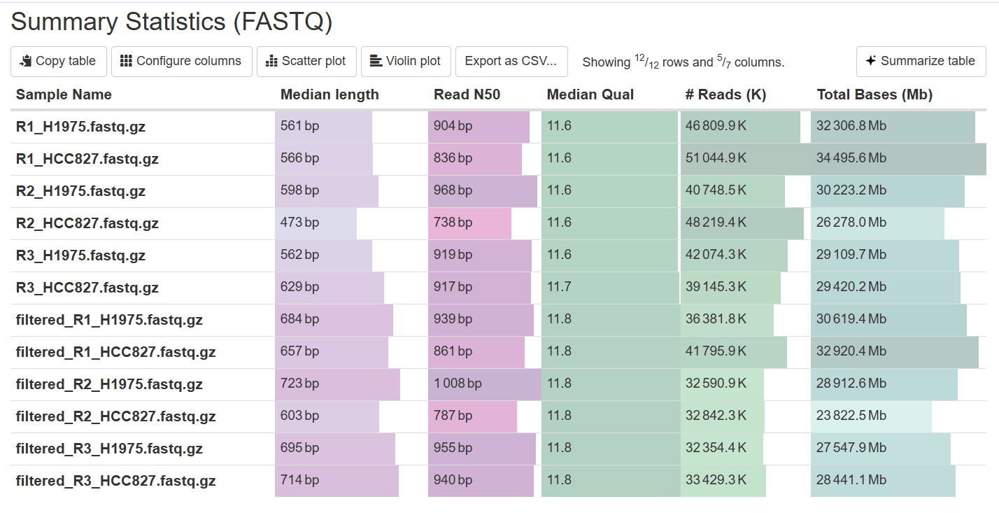
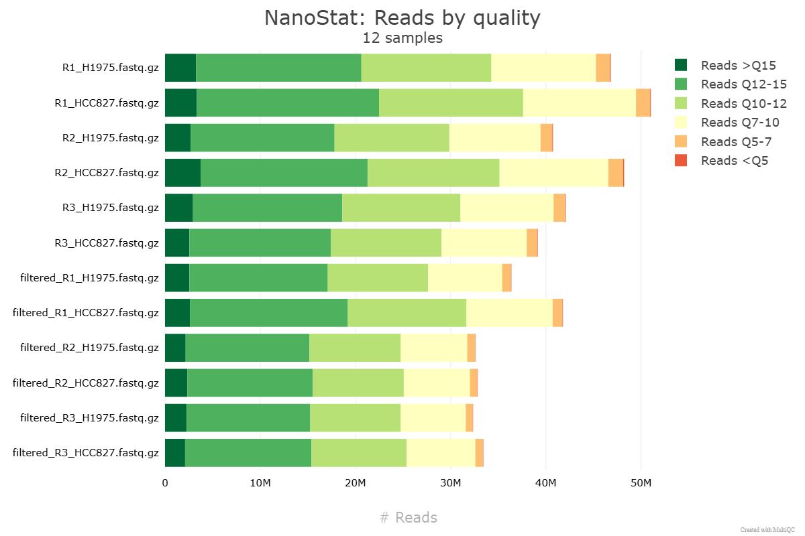
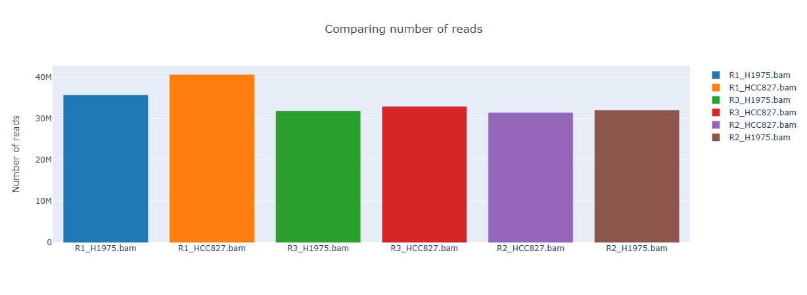
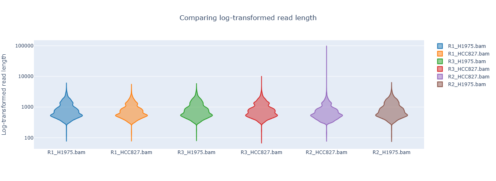
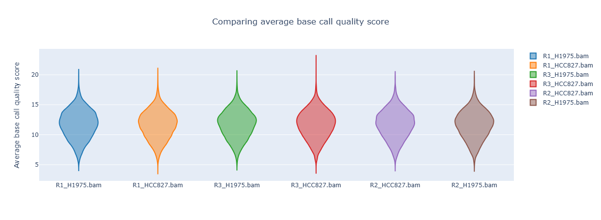
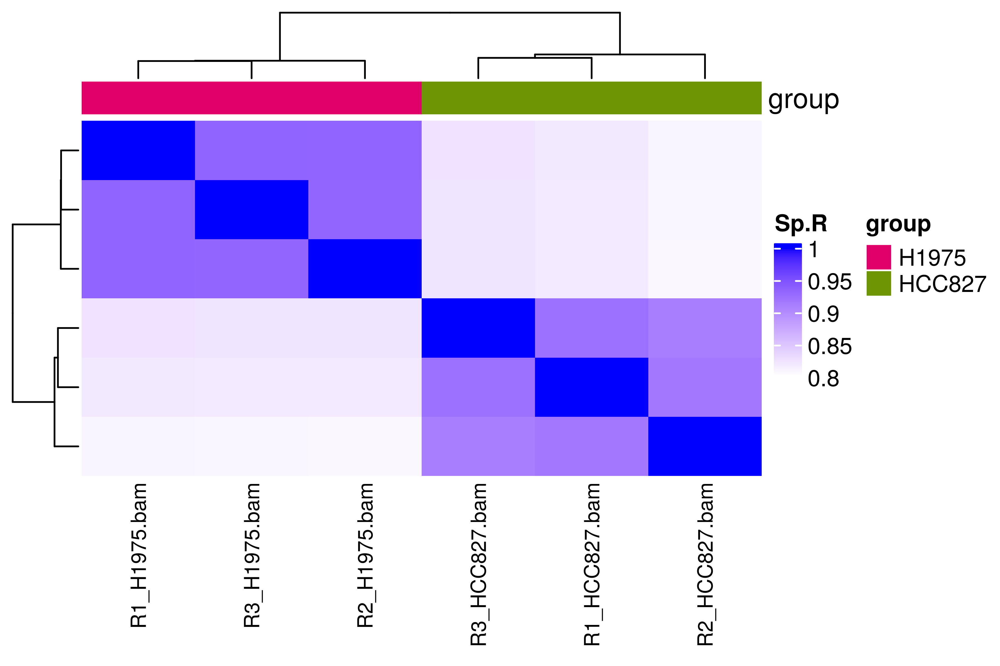
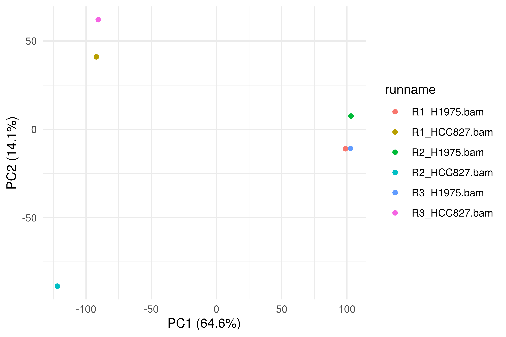
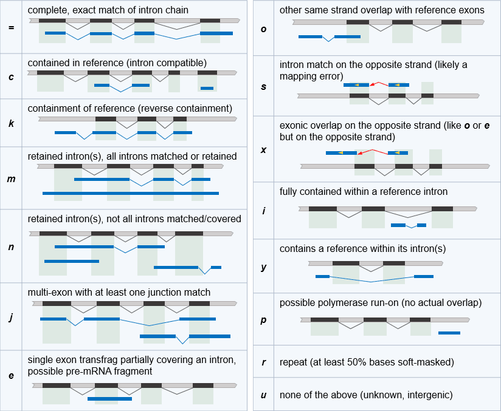
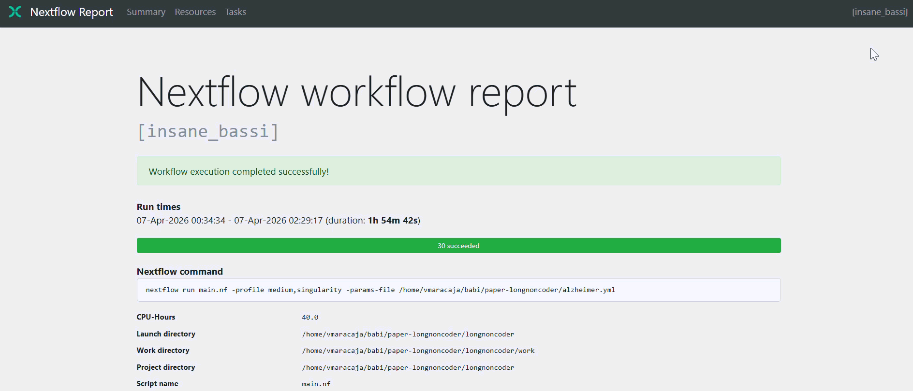

# Output 

This document describes the file-level reference for outputs produced by each pipeline step, which include:

1.  Read quality control and optional filtering
2.  Mapping/alingment of reads to a reference genome
3.  Transcriptome assembly and quantification
4.  Novel RNA isoform candidates classification and coding-potential prediction
5.  Annotation and summarization of assembled isoforms
6.  Final visual reporting
7.  Run traceability

> *All output files are organized by stage-specific directories.*

## `transcriptome_report/` (final report outputs)

| File | Description |
|----------------------|--------------------------------------------------|
| `Bambu_assembly_summary.csv` | Summary table of transcriptome assembly metrics derived from bambu outputs. |
| `Bambu_lncRNA_PC_summary.csv` | Summary table comparing lncRNA and protein-coding assembly status . |
| `report.html` | Final transcriptome report with integrated summaries and visualizations. |

### Report interface

## `chopper/` (read filtering and trimming)

| File | Description |
|-------------------|-----------------------------------------------------|
| `filtered_*.fastq.gz` | Filtered/compressed FASTQ reads generated after filtering/trimming. |

## `multiqc/` (aggregated QC)

### `multiqc/`

| File                  | Description                           |
|-----------------------|---------------------------------------|
| `multiqc_report.html` | Main MultiQC interactive HTML report. |

#### Summary statistics

#### Phred-score quality plot

### `multiqc/multiqc_data/`

| File | Description |
|-------------------------|------------------------------------------------|
| `multiqc_citations.txt` | Citation information for tools represented in the MultiQC report. |
| `multiqc_data.json` | Structured JSON with parsed metrics used to render MultiQC outputs. |
| `multiqc_general_stats.txt` | Tabular general statistics exported by MultiQC. |
| `multiqc.log` | MultiQC execution log. |
| `multiqc_nanostat.txt` | Parsed NanoStat metrics as imported by MultiQC. |
| `multiqc_software_versions.txt` | Software version summary collected by MultiQC modules. |
| `multiqc_sources.txt` | Source file provenance for metrics included in MultiQC. |
| `nanostat_fastq_stats_table.txt` | NanoStat FASTQ summary table extracted by MultiQC. |
| `nanostat_quality_dist.txt` | Quality distribution table extracted by MultiQC. |

### `multiqc/multiqc_plots/pdf/`

| File | Description |
|----------------------------|--------------------------------------------|
| `general_stats_table.pdf` | PDF export of MultiQC general statistics table. |
| `nanostat_fastq_stats_table.pdf` | PDF export of NanoStat FASTQ statistics table. |
| `nanostat_quality_dist-cnt.pdf` | PDF plot of quality-score counts distribution. |
| `nanostat_quality_dist-pct.pdf` | PDF plot of quality-score percentage distribution. |

### `multiqc/multiqc_plots/png/`

| File | Description |
|----------------------------|--------------------------------------------|
| `general_stats_table.png` | PNG export of MultiQC general statistics table. |
| `nanostat_fastq_stats_table.png` | PNG export of NanoStat FASTQ statistics table. |
| `nanostat_quality_dist-cnt.png` | PNG plot of quality-score counts distribution. |
| `nanostat_quality_dist-pct.png` | PNG plot of quality-score percentage distribution. |

### `multiqc/multiqc_plots/svg/`

| File | Description |
|----------------------------|--------------------------------------------|
| `general_stats_table.svg` | SVG export of MultiQC general statistics table. |
| `nanostat_fastq_stats_table.svg` | SVG export of NanoStat FASTQ statistics table. |
| `nanostat_quality_dist-cnt.svg` | SVG plot of quality-score counts distribution. |
| `nanostat_quality_dist-pct.svg` | SVG plot of quality-score percentage distribution. |

## `nanocomp/` (read quality comparison)

### `nanocomp/raw_reads/`

| File | Description |
|--------------------------------|----------------------------------------|
| `AllNanoComp_lengths_violin.html` | Violin plot report for raw-read length distribution. |
| `AllNanoComp_log_length_violin.html` | Violin plot report for raw-read log-length distribution. |
| `AllNanoComp_N50.html` | N50 summary plot/report for raw reads. |
| `AllNanoComp_number_of_reads.html` | Plot/report of raw read counts per sample. |
| `AllNanoComp_OverlayHistogram.html` | Overlay histogram report for raw-read lengths. |
| `AllNanoComp_OverlayHistogram_Normalized.html` | Normalized overlay histogram report for raw-read lengths. |
| `AllNanoComp_OverlayLogHistogram.html` | Overlay log-histogram report for raw-read lengths. |
| `AllNanoComp_OverlayLogHistogram_Normalized.html` | Normalized overlay log-histogram report for raw-read lengths. |
| `AllNanoComp_quals_violin.html` | Violin plot report for raw-read quality score distributions. |
| `AllNanoComp-report.html` | Main NanoComp HTML summary report for raw reads. |
| `AllNanoComp_total_throughput.html` | Throughput plot/report for raw reads. |
| `AllNanoStats.txt` | Text summary statistics generated by NanoComp for raw reads. |

### `nanocomp/filt_reads/`

| File | Description |
|---------------------------------|---------------------------------------|
| `AllNanoComp_lengths_violin.html` | Violin plot report for read-length distribution. |
| `AllNanoComp_log_length_violin.html` | Violin plot report for log-transformed read lengths. |
| `AllNanoComp_N50.html` | N50 summary plot/report for read lengths. |
| `AllNanoComp_number_of_reads.html` | Plot/report of read counts per sample. |
| `AllNanoComp_OverlayHistogram.html` | Overlay histogram report for read lengths. |
| `AllNanoComp_OverlayHistogram_Normalized.html` | Normalized overlay histogram report for read lengths. |
| `AllNanoComp_OverlayLogHistogram.html` | Overlay log-histogram report for read lengths. |
| `AllNanoComp_OverlayLogHistogram_Normalized.html` | Normalized overlay log-histogram report for read lengths. |
| `AllNanoComp_quals_violin.html` | Violin plot report for base quality score distributions. |
| `AllNanoComp-report.html` | Main NanoComp HTML summary report for filtered reads. |
| `AllNanoComp_total_throughput.html` | Throughput plot/report for cumulative bases per sample. |
| `AllNanoStats.txt` | Text summary statistics generated by NanoComp. |

### `nanocomp/mapping/`

| File | Description |
|-------------------------------|-----------------------------------------|
| `AllNanoComp_lengths_violin.html` | Violin plot report for mapped-read length distribution. |
| `AllNanoComp_log_length_violin.html` | Violin plot report for mapped-read log-length distribution. |
| `AllNanoComp_N50.html` | N50 summary plot/report for mapped reads. |
| `AllNanoComp_number_of_reads.html` | Plot/report of mapped read counts per sample. |
| `AllNanoComp_OverlayHistogram.html` | Overlay histogram report for mapped-read lengths. |
| `AllNanoComp_OverlayHistogram_Identity.html` | Overlay histogram report for mapping identity distribution. |
| `AllNanoComp_OverlayHistogram_Normalized.html` | Normalized overlay histogram report for mapped-read lengths. |
| `AllNanoComp_OverlayHistogram_PhredScore.html` | Overlay histogram report for mapped-read Phred score distribution. |
| `AllNanoComp_OverlayLogHistogram.html` | Overlay log-histogram report for mapped-read lengths. |
| `AllNanoComp_OverlayLogHistogram_Normalized.html` | Normalized overlay log-histogram report for mapped-read lengths. |
| `AllNanoComp_percentIdentity_violin.html` | Violin plot report for mapping percent identity distribution. |
| `AllNanoComp_quals_violin.html` | Violin plot report for mapped-read quality scores. |
| `AllNanoComp-report.html` | Main NanoComp HTML summary report for mapped reads. |
| `AllNanoComp_total_throughput.html` | Throughput plot/report for mapped reads. |
| `AllNanoStats.txt` | Text summary statistics generated by NanoComp for mapped reads. |

### Mapped number of reads

### Mapped read length

### Mapped reads' identity to reference

## `minimap2/` (genome mapping)

| File        | Description                                                |
|-------------|------------------------------------------------------------|
| `*.bam`     | Sorted BAM alignment files generated by minimap2/samtools. |
| `*.bam.bai` | BAM index files for the corresponding `*.bam` alignments.  |

## `bambu/` (transcriptome assembly and quantification)

### Raw count-matrix & annotation standard outputs

> *Bambu standard outputs are constructed as an extension of the reference annotation that incorporates the novel RNA isoform candidates. Therefore, the raw files will include reference transcripts/genes that were not assembled. The count-matrix will will contain zero-counts in all samples for these specific extended reference features.*

| File | Description |
|--------------------------------|----------------------------------------|
| `BambuOutput_counts_gene.txt` | Gene-level raw count matrix. |
| `BambuOutput_counts_transcript.txt` | Transcript-level raw count matrix. |
| `BambuOutput_CPM_transcript.txt` | Transcript-level CPM-normalized expression matrix. |
| `BambuOutput_fullLengthCounts_transcript.txt` | Full-length transcript count matrix. |
| `BambuOutput_uniqueCounts_transcript.txt` | Uniquely mapped transcript count matrix. |
| `BambuOutput_extended_annotations.gtf` | Extended reference transcript annotations. |
| `bambu_novel_transcripts.gtf` | Novel isoform candidates identified by Bambu. |

### Standard automatic plots

| File | Description |
|--------------------------------|----------------------------------------|
| `heatmap_gene.png` | Heatmap visualization of gene-level expression patterns. |
| `heatmap_transcript.png` | Heatmap visualization of transcript-level expression patterns. |
| `pca_grouped.png` | PCA plot for samples organized by experimental design groups. |
| `pca.png` | PCA plot for individual samples. |

#### Spearman correlation coefficients

#### PCA analysis 

### Rdata

> [!NOTE]
> You can access Bambu Novel Discovery Rate (NDR) metric by accessing the Summarized Experiment R object `se_multiSample.rds`. It is also output to the module's execution log `.command.log`, stored at the `work/` directory.

| File | Description |
|--------------------------------|----------------------------------------|
| `seGene_multiSample.rds` | Serialized R object with gene-level summarized experiment data. |
| `se_multiSample.rds` | Serialized R object with transcript-level summarized experiment data. |

### Filtered count-matrices

> *Transcripts/genes from the extended reference annotations that have 0-counts in all samples are removed, keeping only annotated and novel features that were actually assembled and quantified by Bambu from the input dataset.*

| File | Description |
|--------------------------------|----------------------------------------|
| `BambuOutput_counts_transcript_filtered.txt` | Filtered transcript-level raw count matrix. |
| `BambuOutput_counts_gene_filtered.txt` | Filtered gene-level raw count matrix. |
| `BambuOutput_CPM_transcript_filtered.txt` | Filtered transcript-level CPM-normalized expression matrix. |
| `BambuOutput_fullLengthCounts_transcript_filtered.txt` | Filtered full-length transcript count matrix. |
| `BambuOutput_fullLengthCounts_transcript_validated.txt` | Full-length transcript count matrix for validated features. |
| `BambuOutput_uniqueCounts_transcript_filtered.txt` | Filtered uniquely mapped transcript count matrix. |

### Validated transcripts & annotations

> *Filtered count-matrices are submitted to validation of novel transcript isoforms, further keeping only the reference features and selected novel lncRNA and protein-coding RNA isoform candidates that were assembled* by Bambu from the input dataset.

| File | Description |
|--------------------------------|----------------------------------------|
| `BambuOutput_counts_gene_validated.txt` | Gene-level raw count matrix restricted to validated features. |
| `BambuOutput_counts_transcript_validated.txt` | Transcript-level raw count matrix restricted to validated features. |
| `BambuOutput_CPM_transcript_validated.txt` | Transcript-level CPM matrix for validated features. |
| `BambuOutput_uniqueCounts_transcript_validated.txt` | Uniquely mapped transcript count matrix for validated features. |
| `BambuOutput_fullLength_validated.gtf` | GTF of validated full-length transcript isoforms. |
| `BambuOutput_annotations_validated.gtf` | Final validated annotation. |
| `BambuOutput_uniquelyMapped_validated.gtf` | Validated transcript isoforms supported by uniquely mapped reads. |

### Annotated GTF attributes

Bambu writes only `gene_id`, `transcript_id` and `exon_number` into its GTF output. pulposeq adds the attributes below to every `GTF` it generates, so each file is self-describing and can be filtered without cross-referencing the metadata tables.

| Attribute | Description |
|--------------------------------|----------------------------------------|
| `transcript_status` | `known` if the transcript is present in the reference annotation, `novel` if it was assembled by Bambu. |
| `gene_biotype` | For known transcripts, the biotype from the reference annotation. For novel transcripts arising from a known gene, that gene's reference biotype; for novel transcripts at previously unannotated loci, `novel`. |
| `transcript_biotype` | For known transcripts, the biotype from the reference annotation. For novel transcripts, `novel_lncRNA` or `novel_protein_coding` according to the RNAmining coding-potential prediction. |
| `gene_name` | Gene symbol, where the reference annotation or gffcompare provides one. |
| `transcript_name` | Transcript name from the reference annotation (known transcripts only). |
| `class_code` | gffcompare class code relative to the reference (novel transcripts only). |
| `classification` | Human-readable reading of `class_code`: intergenic, intronic, antisense, multiexon SJ match, total intron retention or partial intron retention (novel transcripts only). |
| `ref_gene_id` | Reference gene the novel transcript was matched against, where gffcompare found one (novel transcripts only). |

> [!NOTE]
> Novel transcripts frequently arise from genes that are already annotated. In that case `gene_biotype` reports the reference gene's real biotype while `transcript_biotype` records the novel isoform's predicted class, so the two can legitimately differ, e.g. a `novel_lncRNA` transcript within a `protein_coding` gene.

## `gffcompare/` (novel transcript comparison)

> _Check the GffCompare's official [documentation](http://ccb.jhu.edu/software/stringtie/gffcompare.shtml)._

| File | Description |
|-------------------------|------------------------------------------------|
| `compared.annotated.gtf` | GTF output with reference-aware annotation status from gffcompare. |
| `compared.bambu_novel_transcripts.gtf.refmap` | Mapping of reference transcripts to novel isoform candidates assembled. |
| `compared.bambu_novel_transcripts.gtf.tmap` | Mapping/classification table for novel isoform candidatesagainst the reference. |
| `compared.loci` | Loci-level grouping of reference and novel isoform candidates' structures. |
| `compared.stats` | Summary statistics from novel isoform candidates comparison against the reference annotation. |
| `compared.tracking` | Tracking table. |

### GffCompare classification codes

Class_codes description figure below retrieved from the official [documentation](https://ccb.jhu.edu/software/stringtie/gffcompare_codes.png).

## `gffread/` (sequence extraction)

| File | Description |
|------------------------|------------------------------------------------|
| `bambu_novel_transcripts.fa` | FASTA sequences extracted for bambu novel isoform candidates. |

## `rnamining/` (coding potential prediction for novel transcripts)

| File | Description |
|------------------|------------------------------------------------------|
| `codings.txt` | List of novel isoform candidates predicted as protein-coding RNAs. |
| `noncodings.txt` | List of novel isoform candidates predicted as non-coding RNAs. |
| `predictions.txt` | Full RNAmining prediction output for all evaluated novel isoform candidates. |

## `annotations_metadata/` (metadata handling)

| File | Description |
|-------------------------|-----------------------------------------------|
| `annotated_lncRNAs_exonlength.csv` | Exon length summary for annotated lncRNA transcripts. |
| `annotated_lncRNAs_metadata.csv` | Metadata table for annotated lncRNA transcripts. |
| `annotated_protein-coding_exonlength.csv` | Exon length summary for annotated protein-coding transcripts. |
| `annotated_protein-coding_metadata.csv` | Metadata table for annotated protein-coding transcripts. |
| `annotated_transcriptome_metadata.csv` | Metadata summary for the entire annotated transcriptome. |
| `bambu_annotated_lncRNAs.gtf` | GTF annotation file containing annotated lncRNA isoforms from bambu outputs. |
| `bambu_annotated_mRNAs.gtf` | GTF annotation file containing annotated mRNA/protein-coding isoforms from bambu outputs. |
| `bambu_annotated_transcriptome_gene_counts.csv` | Gene-level count matrix for annotated transcriptome features. |
| `bambu_annotated_transcriptome.gtf` | GTF file for validated annotated features assembled/quantified by bambu. |
| `bambu_annotated_transcriptome_tx_counts.csv` | Transcript-level count matrix for annotated transcriptome features. |
| `bambu_novel_pc_lnc_RNA_gene_counts.csv` | Gene-level counts for novel isoform candidates classified as protein-coding or lncRNA. |
| `bambu_novel_pc_lnc_RNA_tx_counts.csv` | Transcript-level counts for novel isoform candidates classified as protein-coding or lncRNA. |
| `novel_lncRNA_exon_lengths.csv` | Exon length summary for novel lncRNA isoform candidates. |
| `novel_lncRNAs.gtf` | GTF file containing novel lncRNA isoform candidates. |
| `novel_lncRNAs_metadata.csv` | Metadata table for novel lncRNA isoform candidates. |
| `novel_pc_lnc_RNAs_metadata.csv` | Combined metadata table for novel protein-coding and lncRNA transcript isoform candidates. |
| `novel_protein-coding_exon_lengths.csv` | Exon length summary for novel protein-coding isoform candidates. |
| `novel_protein-coding.gtf` | GTF file containing novel protein-coding RNA isoform candidates. |
| `novel_protein-coding_metadata.csv` | Metadata table for novel protein-coding RNA isoform candidates. |
| `novel_transcripts_metadata.csv` | Metadata table for all novel RNA isoform candidates. |
| `novel_transcripts.gtf` | GTF file containing only the validated set of novel isoform candidates. |

## `pipeline_info/` (workflow run metadata)

| File | Description |
|--------------------------|----------------------------------------------|
| `execution_report_<timestamp>.html` | Nextflow execution report with runtime, resources, and process-level summaries. |
| `execution_timeline_<timestamp>.html` | Nextflow execution timeline visualization. |
| `execution_trace_<timestamp>.txt` | Nextflow trace table with task-level runtime and resource usage. |
| `nf_core_pipeline_software_mqc_versions.yml` | Consolidated software versions used in the run and reported by MultiQC. |
| `params_<timestamp>.json` | Parameters snapshot used for the current pipeline run. |
| `pipeline_dag_<timestamp>.html` | DAG visualization of process dependencies for the current pipeline run. |

### Resource usage

## Nextflow reports

Nextflow provides excellent functionality for generating various [reports](https://www.nextflow.io/docs/latest/reports.html) relevant to the running and execution of the pipeline. This will allow you to troubleshoot errors with the running of the pipeline, and also provide you with other information such as launch commands, run times and resource usage.
